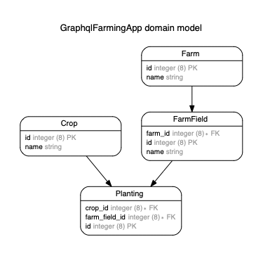

This is a simple example of an app with a GraphQL API.

It's meant to be a comparison with a REST API. Not advocating either approach, just a demonstration.

# Database Schema

# Deployment
Go ahead and deploy this to Heroku!

# License

This project is [MIT Licensed](./LICENSE.md)
